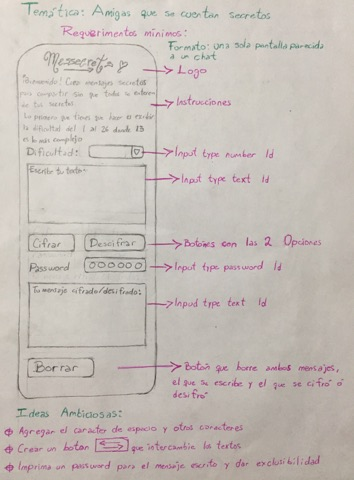
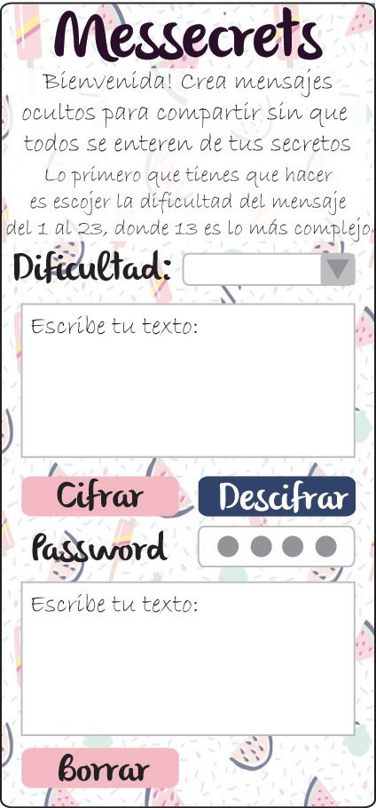

# Messecrets

Bienvenido a Messecrets! Crea mensajes secretos para compartir con tus amigas sin que otra persona se entere.

- Para poder cifrar deberás indicar cuantos espacios recorrerá tu mensaje para cifrar. Esto le dará la dificultad

- Después escribe el texto que quieras cifrar o decifrar y al dar click aparecerá en el siguiente recuadro.
- Es necesario un pasword para asegurar de que no calquiera puede desifar tus mensajes
- Recibe el resultado en el cuadro de abajo
- Para asegurar que nadie más lo lea, da click en limpiar y se borrará el texto.
- Prototipo hecho a mano:

## UX
**Tipo de usuarios:** Amigas que deseen tener un código secreto para comunicarse entre ellas. 

**Soluciones y necesidades:** Tener una forma de comunicarse entre ellas sin que nadie más sepa de que trata el mensaje y que solo entre ellas puedan desifrar. Platicar a través de mensajes de manera segura y privada sin el temor de que alguien más pueda leer y entender lo que comparten.

**Feedback:** Cuado hice mi primer prototipo no estaban claras las indicaciones de cómo se usa la app, así que agregué un texto para las indicaciones.
Otra cosa que me compartieron fue que no era muy claro el acomodo de mis divs y ya lo acomodé.

**Prototipo final:**

